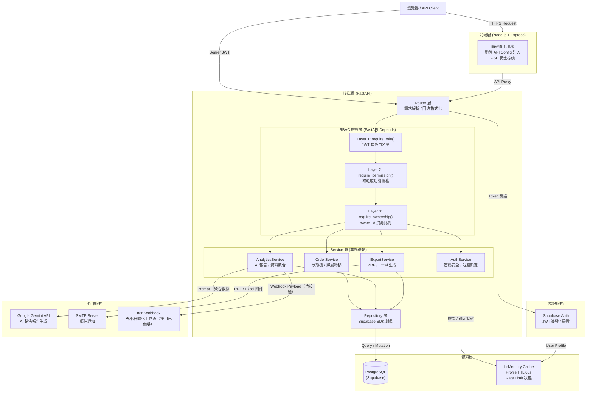
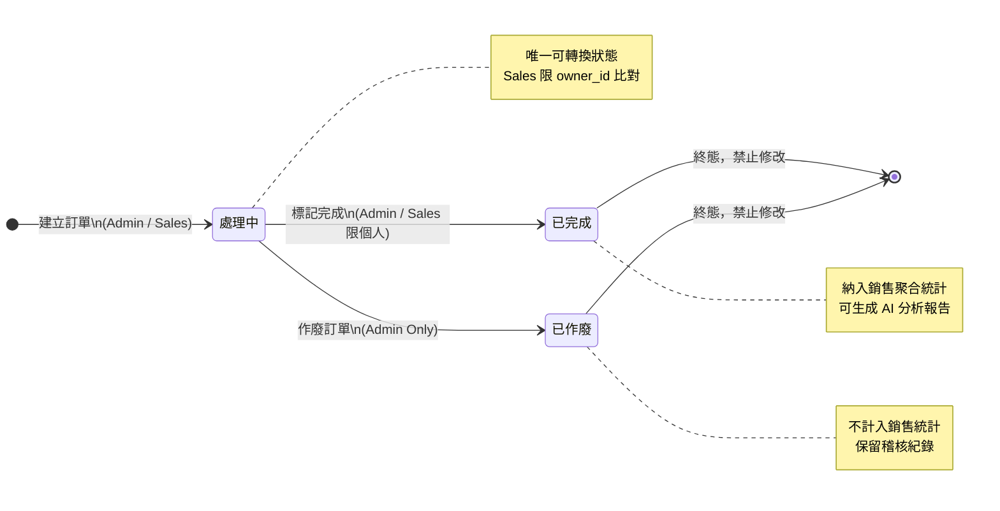
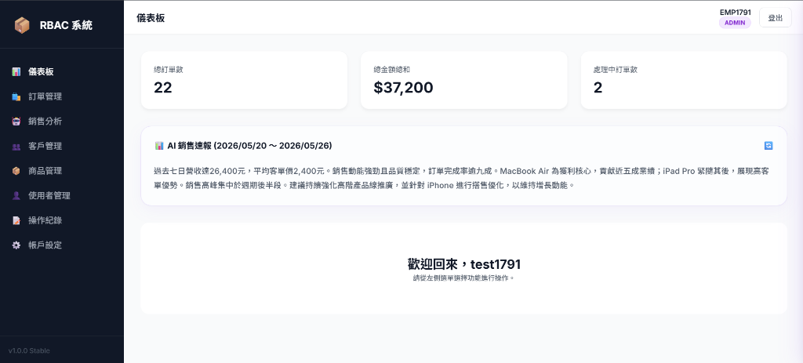
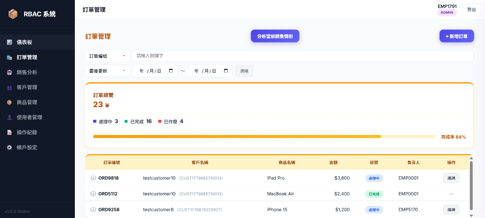
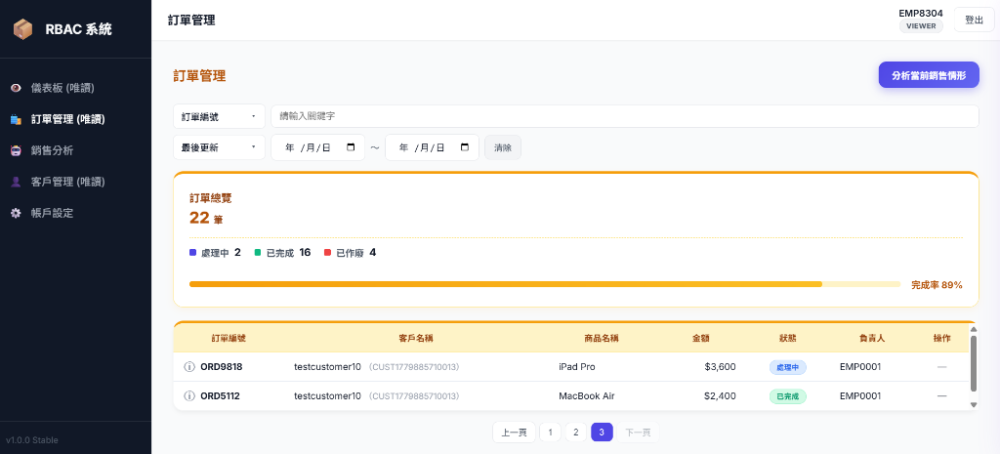
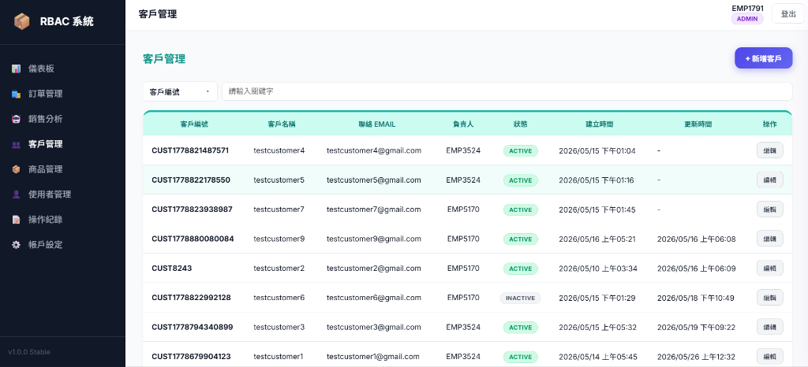
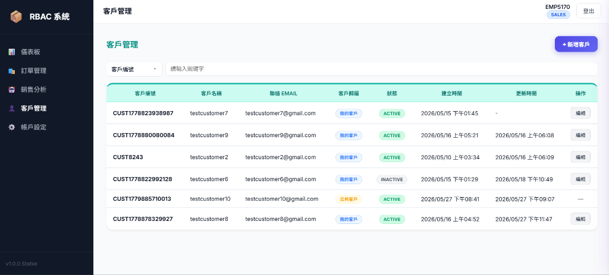

<div align="center">

# RBAC Order Management System

**企業內部銷售流程管控平台**

以角色型存取控制（RBAC）為核心，強制執行訂單生命週期業務規則，<br>
實現精準的多角色資料隔離、全程稽核追蹤與 AI 驅動商業智慧分析。

<br>


</div>

---

## 系統核心能力

| 能力 | 說明 |
|------|------|
| **三層 RBAC 存取控制** | Role → Permission → Ownership 遞進驗證，每層為獨立 FastAPI `Depends`，可組合掛載 |
| **訂單生命週期狀態機** | 強制後端狀態轉換驗證，終態保護，角色操作邊界以 `owner_id` 嚴格隔離 |
| **業務規則強制執行** | 客戶歸屬原子轉移、並發衝突 409 保護、Sales 資料範圍硬性限縮，前端無法繞過 |
| **完整稽核追蹤** | 所有寫入操作即時寫入 Audit Log，支援操作人、目標資源、時間戳記完整查詢 |
| **AI 商業智慧報告** | Gemini API 依角色生成差異化分析，MD5 指紋快取、Pydantic Schema 驗證、非同步背景生成 |
| **防暴力破解防禦** | 指數退避延遲 + 帳號臨時鎖定，Thread-Safe 設計，具備 Redis 無縫移轉路徑 |

---

## 功能亮點

- 🔐 **多角色資料隔離** — Admin 全局、Sales 個人、Viewer 純唯讀，同一端點依角色回傳不同範圍資料
- ⚙️ **工作流程狀態管控** — 訂單狀態轉換在後端以狀態機強制驗證，拒絕違規操作並寫入稽核紀錄
- 🤖 **AI 角色差異化報告** — Admin/Viewer 取得宏觀策略分析，Sales 取得個人業績微觀建議
- 📊 **多格式報表匯出** — PDF（含圖表）/ Excel 多工作表，Viewer 角色後端強制禁止 Excel 匯出
- 📬 **雙軌制郵件通知** — SMTP 直寄附件 + n8n Webhook 外部自動化介面（接口已備妥），環境變數動態切換
- 🛡️ **安全隱蔽設計** — 未授權存取一律回傳 `404`（非 `403`），避免資源存在性洩露

---

## 目錄

- [系統概觀](#系統概觀)
- [系統架構](#系統架構)
- [RBAC 權限系統](#rbac-權限系統)
- [訂單工作流程](#訂單工作流程)
- [模組架構](#模組架構)
- [API 設計](#api-設計)
- [安全機制](#安全機制)
- [部署](#部署)
- [安裝與開發環境](#安裝與開發環境)
- [系統截圖](#系統截圖)
- [開發進程與架構演進規劃](#開發進程與架構演進規劃)
- [專案結構](#專案結構)

---

## 系統概觀

### 業務背景

本平台為企業內部銷售團隊量身設計，解決傳統試算表或鬆散 API 所無法處理的核心痛點：**多角色並行操作下的資料完整性與權限邊界維護**。

系統以銷售組織的典型職能分工為基礎，設計三個操作角色——管理員（Admin）、銷售專員（Sales）、檢視者（Viewer）——各自擁有嚴格定義的資料存取範圍與操作權限，且所有邊界均在後端強制執行，前端 UI 的限制不作為安全保障依據。

---

### 訂單管理

訂單（Order）為系統的核心業務物件，關聯商品（Product）、客戶（Customer）與負責人（`owner_id`），並透過狀態機管理其生命週期。

每筆訂單自建立起即進入「處理中」狀態，並以非同步 `owner_id` 比對確保銷售專員只能看到與操作自己負責的訂單。管理員可跨越所有邊界執行操作（包含作廢終止），而銷售專員的操作範圍被硬性限縮至 `owner_id == employee_id` 的資源集合內。

> **典型場景**：銷售專員 A 開立一筆訂單後，即使透過直接 API 呼叫提供他人的 `order_id`，後端亦會回傳 `404`，而非 `403`——不暴露資源是否存在。

---

### 業務規則強制執行

所有業務邊界均在後端 Service 層強制執行，前端 UI 控制不作為安全保障：

- **自我註冊禁止**：`/auth/register` 已永久移除，帳號建立僅允許 Admin 操作
- **Excel 匯出攔截**：Viewer 嘗試下載 Excel 時，Service 層直接拋出 `403`，API 直接呼叫亦無法繞過
- **AI 分析資料隔離**：Gemini 呼叫前先執行角色資料聚合隔離，Sales 報告基於個人數據，非報告生成後裁切
- **密碼修改防護**：連續 5 次失敗後帳號鎖定 15 分鐘，指數退避 Thread-Safe，保留 Redis 移轉路徑

---

## 系統架構

### 架構概覽

系統採用**前後端分離架構**，後端以 FastAPI 建構 RESTful API 服務，前端為 Node.js Express 靜態服務，兩者均部署於 Render 雲端平台。所有請求在進入業務邏輯前，均須通過 RBAC 驗證層（JWT 解析 → 角色比對 → 資源所有權確認），業務邏輯集中於 Service 層，資料存取統一透過 Repository 層封裝。



---

### 分層職責說明

| 層級 | 元件 | 職責邊界 |
|------|------|---------|
| **前端層** | Node.js + Express | 靜態資源服務、動態 API 端點注入、CSP 安全標頭管理 |
| **路由層** | FastAPI Router | HTTP 請求解析、Pydantic 輸入驗證、回應格式化；不含業務邏輯 |
| **RBAC 驗證層** | FastAPI Depends | 三層遞進驗證（角色 → 權限 → 所有權），可組合注入任意路由 |
| **業務邏輯層** | Service Classes | 狀態機管控、歸屬轉移、AI 報告生成、匯出渲染；所有業務規則集中於此 |
| **資料存取層** | Repository Classes | Supabase SDK 封裝，統一處理查詢條件注入（含角色資料範圍篩選） |
| **資料層** | PostgreSQL | 主要資料持久化；Row Level Security 作為資料庫層的最後一道隔離防線 |
| **快取層** | In-Memory Cache | Profile 60 秒 TTL 快取（降低 Supabase 查詢頻率）；Rate Limit 失敗計數管理 |
| **認證服務** | Supabase Auth | JWT 簽發與驗證；Admin SDK 用於管理員帳號操作（建立 / 停用）|

---

### 技術棧

技術選型以**最小外部依賴、可獨立替換各層元件**為原則。各層邊界清晰，例如快取層可從 In-Memory 平滑移轉至 Redis，無需修改 Service 層業務邏輯。

#### 後端框架

| 技術 | 版本 | 在系統中的角色 |
|------|------|--------------|
| **Python** | 3.11+ | 主要開發語言；型別提示搭配 Pydantic v2 強化執行期型別安全 |
| **FastAPI** | ≥ 0.100 | 非同步 ASGI 框架；`Depends` 注入系統作為 RBAC 三層驗證的載體；自動生成 OpenAPI 文件 |
| **Uvicorn** | ≥ 0.23 | ASGI 伺服器；Render 部署以單 worker 模式運行 |
| **Pydantic v2** | ≥ 2.0 | 所有 API 輸入／輸出的 Schema 定義與驗證；`AIReportResponse` 對 Gemini JSON 輸出進行強制 Schema 驗證 |
| **SlowAPI** | ≥ 0.1.9 | ASGI 相容速率限制中介層；搭配自訂 `429` 例外處理器注入 `X-RateLimit-*` 標頭 |

#### 資料庫

| 技術 | 版本 | 在系統中的角色 |
|------|------|--------------|
| **PostgreSQL** | 15+（Supabase 託管）| 主要關聯式資料庫；`profiles`、`orders`、`customers`、`products`、`audit_logs`、`report_history`、`analytics_subscriptions` 等核心資料表 |
| **Supabase** | ≥ 2.0 | PostgreSQL 託管平台；提供 Row Level Security（RLS）作為資料庫層的最後一道隔離防線；`supabase-py` SDK 封裝於 Repository 層 |
| **Row Level Security** | — | 與應用層 RBAC 互為縱深防禦；即使 Repository 層查詢條件出現漏洞，RLS Policy 仍阻止跨使用者資料存取 |

#### 身份驗證

| 技術 | 版本 | 在系統中的角色 |
|------|------|--------------|
| **Supabase Auth** | ≥ 2.0 | JWT 簽發與驗證；管理員操作（帳號建立 / 停用 / 密碼重設）使用 Service Role Key 的 Admin SDK，與一般使用者操作路徑隔離 |
| **JWT** | — | Bearer Token 置於 `Authorization` Header；`get_current_user` Depends 同時支援 Query Parameter（`?token=`）供檔案下載端點使用 |
| **Profile Cache** | — | JWT 驗證後的 Profile 查詢結果以 In-Memory 快取 60 秒 TTL，避免每次請求均觸發 Supabase 資料庫往返 |

#### 快取

| 技術 | 版本 | 在系統中的角色 |
|------|------|--------------|
| **In-Memory Cache（自實作）** | — | 雙用途：① Profile TTL 快取（60s）降低認證查詢頻率；② `RateLimitCache` 管理密碼失敗計數與帳號鎖定狀態 |
| **`lru_cache`（標準庫）** | — | 銷售速報（Realtime Insights）以 1 小時為快取窗口，相同聚合數據在同一小時內不重複呼叫 Gemini API |
| **Redis（預備路徑）** | — | `RateLimitCache` 已於程式碼中完整標注 `redis-py` 替換方案（`INCR` + `SETEX` + `TTL`），多實例部署時可無縫移轉 |

#### AI 分析與報表匯出

| 技術 | 版本 | 在系統中的角色 |
|------|------|--------------|
| **Google Gemini API** | gemini-flash | 依角色生成差異化銷售分析報告；System Prompt 動態調整分析視角（Admin/Viewer 宏觀、Sales 微觀）；支援同步與非同步背景生成兩種模式 |
| **ReportLab** | ≥ 4.0 | PDF 報告生成；支援繁體中文字體（微軟正黑體）、Matplotlib 圖表以 `BytesIO` 嵌入、AI 洞察區塊動態渲染 |
| **Matplotlib** | ≥ 3.7 | 每日銷售折線圖 + 熱銷商品條形圖，強制使用 `Agg` 後端避免伺服器環境 GUI 衝突 |
| **Pandas + openpyxl** | ≥ 2.0 / ≥ 3.1 | 多工作表 Excel 報告（統計摘要 / 商品排行 / 原始訂單明細）；Viewer 角色在 Service 層強制攔截，無法觸及此路徑 |

#### 通知與整合

| 技術 | 版本 | 在系統中的角色 |
|------|------|--------------|
| **Google Gmail API** | — | 優先郵件通道；走 HTTPS 443 埠，完全規避 Render 平台對 SMTP 埠的封鎖；OAuth2 憑證透過環境變數注入 |
| **SMTP（aiosmtplib）** | — | 非同步直寄，附帶 PDF / Excel 附件與 HTML 模板；Viewer 角色收到的郵件自動排除 Excel 附件 |
| **n8n Webhook** | — | 雙軌制通知的第二軌（接口已備妥）；將報告 Payload 發送至 n8n 自動化工作流，支援與 Slack、CRM 等外部系統整合；只需設定 `N8N_WEBHOOK_URL` 與 `ENABLE_N8N_WEBHOOK=True` 即可啟用 |
| **httpx** | ≥ 0.24 | 非同步 HTTP 用戶端；用於 Webhook 發送，設定 10 秒 Timeout 防止外部服務無限阻塞 |

#### 容器化與部署

| 技術 | 版本 | 在系統中的角色 |
|------|------|--------------|
| **Docker** | — | 後端與前端均提供 Dockerfile；環境變數統一透過 `.env` 注入，無硬編碼設定 |
| **python-dotenv** | ≥ 1.0 | 本地開發環境變數載入；生產環境由容器編排平台（如 Docker Compose / Kubernetes）注入 |

---

## RBAC 權限系統

### 設計原則

本系統的 RBAC 實作遵循三項核心原則：

1. **最小權限原則（Least Privilege）** — 每個角色僅持有完成業務職能所需的最小操作範圍，Viewer 無任何寫入途徑，Sales 的資料視野硬性限縮於個人負責範圍
2. **後端強制（Backend-Enforced）** — 所有權限邊界均在 API 層驗證，前端 UI 的顯示/隱藏邏輯不作為安全保障，直接呼叫 API 亦受相同約束
3. **資源存在性隱蔽（Existence Concealment）** — 未授權存取一律回傳 `404`（非 `403`），攻擊者無法透過錯誤碼探測資源是否存在

---

### 角色能力定義

系統定義三個操作角色，各自具備嚴格的能力邊界：

| 能力項目 | Admin | Sales | Viewer |
|---------|:-----:|:-----:|:------:|
| 唯讀限制 | ❌ | ❌ | ✅（強制）|
| 管理使用者帳號 | ✅ | ❌ | ❌ |
| 建立資源（訂單/客戶）| ✅ | ✅ | ❌ |
| 檢視稽核日誌 | ✅ | ❌ | ❌ |
| 資料範圍 | 全局 | 個人（`owner_id`）| 全局（唯讀）|

> **Sales 的「建立資源」能力受到額外約束**：建立訂單時只能選擇歸屬於自己或 Admin 的客戶；`owner_id` 在後端強制覆寫為自身 `employee_id`，前端傳入的 `owner_id` 欄位對 Sales 角色無效。

---

### 三層遞進式驗證架構

每一層均實作為獨立的 FastAPI `Depends` 函式，可自由組合掛載至任意路由端點。

#### Layer 1 — 角色白名單驗證 `require_role()`

```python
# 路由聲明：僅允許 admin 與 sales 呼叫此端點
@router.post("/orders", dependencies=[Depends(require_role(["admin", "sales"]))])
```

從 JWT Payload 解析 `role` 欄位，比對傳入的角色白名單。若角色不符，拋出 `404`。**此為所有路由的第一道關卡**，負責快速排除無效角色，阻止進入後續業務邏輯。

#### Layer 2 — 細粒度功能權限驗證 `require_permission()`

```python
# 路由聲明：需具備 ORDER_EDIT 功能權限
@router.put("/orders/{order_id}", dependencies=[Depends(require_permission("ORDER_EDIT"))])
```

對應 `permissions.py` 中的 `PERMISSIONS` 定義表（字典結構，鍵為權限名稱，值為允許角色清單）。相較於 Layer 1 的角色白名單，此層提供**語意化的功能授權**，使路由層的意圖清晰，且變更授權規則僅需修改 `PERMISSIONS` 字典，無需觸動路由程式碼。

額外規則：`viewer` 角色在此層會進行額外攔截——若存取的不是以 `_VIEW` 結尾的權限，直接拒絕，作為唯讀強制的第二道保障。

#### Layer 3 — 資源所有權驗證 `require_ownership()`

```python
# 路由聲明：驗證請求者是否擁有此 order 資源
@router.patch("/orders/{order_id}/status",
              dependencies=[Depends(require_ownership("order", "order_id"))])
```

此層為 **Sales 角色的核心資料隔離機制**，執行流程如下：

```
取得 path param resource_id
        │
        ▼
依 resource_type 查詢資源（Order / Customer / User）
        │
        ▼
取得資源的 owner_id 欄位
        │
        ▼
比對 owner_id == 當前使用者 employee_id
        │
   ┌────┴────┐
  符合       不符合
   │           │
繼續執行     回傳 404
```

`Admin` 角色在此層直接通過，無需所有權比對。`Viewer` 角色在此層直接拒絕，不執行資源查詢。

---

### 路由保護組合模式

實務中，三層驗證以 `Depends` 鏈式組合，不需重複定義：

```python
# 完整三層組合範例（Sales 修改訂單狀態）
@router.patch("/orders/{order_id}/status")
async def update_order_status(
    order_id: str,
    body: OrderStatusUpdate,
    user: dict = Depends(require_ownership("order", "order_id"))
    #           ^^^^^^^^^^^^^^^^^^^^^^^^^^^^^^^^^^^^^^^^^^^^^^^^
    #           require_ownership 內部已依賴 require_role / require_permission
    #           三層驗證在此一行完成
):
    ...
```

各端點的保護組合根據業務語義選擇，例如：
- 純查詢端點 → `require_permission("ORDER_VIEW")` 即可（Layer 2 已含 Layer 1）
- 寫入端點（Admin/Sales 共用）→ `require_permission("ORDER_EDIT")` + Service 層角色判斷
- 資源修改端點（需所有權）→ `require_ownership("order", "order_id")`（Layer 3 已含前兩層邏輯）

---

### 完整功能權限矩陣

#### 訂單與客戶權限

| 功能權限 | Admin | Sales | Viewer | 資料範圍備注 |
|---------|:-----:|:-----:|:------:|------------|
| `ORDER_VIEW` | ✅ | ✅ | ✅ | Admin/Viewer 全局；Sales 僅個人 `owner_id` |
| `ORDER_CREATE` | ✅ | ✅ | ❌ | Sales 的 `owner_id` 後端強制覆寫 |
| `ORDER_EDIT` | ✅ | ✅ | ❌ | Sales 限個人訂單 |
| `ORDER_COMPLETE` | ✅ | ✅ | ❌ | 僅限「處理中」狀態；Sales 限個人 |
| `ORDER_VOID` | ✅ | ❌ | ❌ | 僅 Admin；終態操作 |
| `CUSTOMER_VIEW` | ✅ | ✅ | ✅ | Admin/Viewer 全局；Sales 僅個人 |
| `CUSTOMER_CREATE` | ✅ | ✅ | ❌ | — |
| `CUSTOMER_EDIT` | ✅ | ✅ | ❌ | Sales 限個人客戶 |
| `CUSTOMER_VOID` | ✅ | ❌ | ❌ | 僅 Admin |

#### 使用者管理與系統權限

| 功能權限 | Admin | Sales | Viewer | 備注 |
|---------|:-----:|:-----:|:------:|------|
| `USER_VIEW` | ✅ | ❌ | ❌ | 使用者列表屬敏感資訊 |
| `USER_CREATE` | ✅ | ❌ | ❌ | 帳號建立為 Admin 專屬操作 |
| `USER_EDIT` | ✅ | ❌ | ❌ | 含角色指派 |
| `USER_DELETE` | ✅ | ❌ | ❌ | — |
| `USER_MANAGE_ROLE` | ✅ | ❌ | ❌ | 角色變更須記錄稽核日誌 |
| `AUDITLOG_VIEW` | ✅ | ❌ | ❌ | 稽核日誌僅供 Admin 查閱 |
| `ANALYTICS_VIEW` | ✅ | ✅ | ✅ | 資料聚合範圍依角色隔離 |

#### 匯出與 AI 報告權限

| 功能 | Admin | Sales | Viewer | 強制機制 |
|------|:-----:|:-----:|:------:|---------|
| PDF 報告下載 | ✅ | ✅ | ✅ | Service 層 AI 降級保護 |
| Excel 明細匯出 | ✅ | ✅（個人）| ❌ | **Service 層強制拋出 `403`** |
| AI 報告生成 | ✅ 宏觀視角 | ✅ 微觀視角 | ✅ 宏觀視角 | 資料聚合前先隔離，非報告後過濾 |
| 背景 AI 報告任務 | ✅ | ✅ | ✅ | 同上，角色資料隔離在任務啟動時確定 |

---

### 資料範圍隔離實作

「資料範圍隔離」並非 UI 層的條件渲染，而是在 **Service 層以角色動態注入查詢條件**：

```python
# OrderService.get_orders() 資料範圍隔離實作
async def get_orders(user: dict) -> List[dict]:
    role = user["profile"]["role"]
    employee_id = user["profile"]["employee_id"]

    if role == "sales":
        # 查詢條件動態注入 owner_id，確保 Sales 僅能取得個人訂單
        return repo.get_orders(owner_id=employee_id)
    elif role in ["admin", "viewer"]:
        # Admin / Viewer 取得全局資料，但 Viewer 禁止後續寫入
        return repo.get_orders()
```

相同邏輯同樣應用於 Analytics 資料聚合，確保 Sales 的 AI 報告所基於的數據集從聚合階段就已隔離，而非在報告呈現後裁切。

---

## 訂單工作流程

### 生命週期概覽

訂單（Order）自建立至終態，由後端 `OrderService` 以狀態機（State Machine）機制強制管控每一次狀態轉換。系統不允許任何直接跳轉至非法目標狀態的操作，所有轉換請求均在 Service 層驗證合法性後方可寫入資料庫。

> **設計定位**：狀態機邏輯集中於 `order_service.py`，路由層僅接受 `new_status` 參數並轉發，**不包含任何狀態合法性判斷**，確保業務規則有唯一的執行點（Single Source of Truth）。

---

### 訂單狀態圖



---

### 狀態定義

| 狀態 | 識別值 | 初始條件 | 終態 | 說明 |
|------|--------|---------|:----:|------|
| **處理中** | `處理中` | 訂單建立時自動設定 | ❌ | 唯一可執行狀態轉換的狀態 |
| **已完成** | `已完成` | 由「處理中」轉換 | ✅ | 納入銷售統計；可作為 AI 分析報告的數據來源 |
| **已作廢** | `已作廢` | 由「處理中」轉換 | ✅ | 排除於銷售統計之外；稽核紀錄完整保留 |

---

### 狀態轉換規則矩陣

| 來源狀態 → 目標狀態 | Admin | Sales | Viewer | 附加約束 |
|--------------------|:-----:|:-----:|:------:|---------|
| 建立 → 處理中 | ✅ | ✅ | ❌ | `owner_id` 由後端強制寫入 |
| 處理中 → 已完成 | ✅ | ✅ | ❌ | Sales 限個人訂單（`owner_id` 比對）|
| 處理中 → 已作廢 | ✅ | ❌ | ❌ | 僅 Admin 可執行終止操作 |
| 已完成 → 任何狀態 | ❌ | ❌ | ❌ | 終態保護，後端強制拒絕 |
| 已作廢 → 任何狀態 | ❌ | ❌ | ❌ | 終態保護，後端強制拒絕 |

---

### 無效狀態轉換防禦

狀態合法性驗證實作於 `OrderService.update_order_status()`，**RBAC 所有權驗證必須在狀態機驗證之前執行**，避免不同的錯誤碼洩漏資源存在性資訊：

```python
async def update_order_status(order_id, new_status, user):
    repo = OrderService._get_repo(admin=True)

    # Step 1：查詢當前訂單
    current_order = repo.get_order_by_id(order_id)
    if not current_order:
        raise HTTPException(status_code=404, detail="找不到資源或無權限存取")

    # Step 2：RBAC 所有權驗證（必須先於狀態機，避免洩露資源存在性）
    if role == "sales" and current_order["owner_id"] != employee_id:
        raise HTTPException(status_code=404, detail="找不到資源或無權限存取")
    elif role not in ["admin", "sales"]:
        raise HTTPException(status_code=404, detail="找不到資源或無權限存取")

    # Step 3：狀態機合法性驗證（唯有「處理中」可進行轉換）
    if current_order["status"] != "處理中":
        raise HTTPException(
            status_code=403,
            detail=f"訂單狀態為 {current_order['status']}，不可修改"
        )

    # Step 4：寫入新狀態 + 更新時間戳
    updated_order = repo.update_order(order_id, {
        "status": new_status,
        "updated_at": datetime.now(timezone.utc).isoformat()
    })

    # Step 5：寫入稽核日誌
    await audit_service.log_action(
        user_id=employee_id,
        action="UPDATE_ORDER_STATUS",
        target=f"Order ID: {order_id}, New Status: {new_status}"
    )
```

**關鍵設計決策**：Step 2（RBAC）刻意置於 Step 3（狀態機）之前。若調換順序，攻擊者可透過嘗試修改他人終態訂單，根據回傳的 `403`（狀態不可修改）與 `404`（無權限）差異，推斷目標訂單是否存在。

---

### 業務規則強制執行

#### 客戶歸屬原子轉移

訂單建立是觸發客戶歸屬轉移的唯一業務事件。當 Sales 建立訂單並選擇歸屬 Admin 的客戶時，系統執行以下原子操作序列：

```
① 驗證客戶歸屬（查詢 customer.owner_id）
          │
          ▼
② 條件更新（CAS）：
   UPDATE customers
   SET owner_id = :sales_employee_id
   WHERE customer_id = :id AND owner_id = :original_admin_id
          │
     ┌────┴────┐
   成功         失敗（並發衝突）
     │               │
     ▼               ▼
③ 建立訂單      拋出 409 Conflict
     │           「客戶已被其他同事分派」
     ▼
④ 寫入 TRANSFER_CUSTOMER 稽核日誌
   { from_owner_id, to_owner_id, trigger_order_id, reason }
```

條件更新（`WHERE owner_id = :original`）的 CAS 語意保證即使在高並發下，客戶歸屬僅能轉移給第一位成功執行的 Sales，其餘請求一律收到 `409`，避免客戶重複分派。

#### 統計數據一致性

銷售聚合統計（`AnalyticsService.aggregate_orders()`）僅計入狀態為「**已完成**」的訂單，「處理中」與「已作廢」訂單不計入銷售額與銷售量。此規則確保 AI 分析報告所呈現的營收數字與業務實際成交結果一致。

---

### 稽核追蹤覆蓋範圍

每次訂單狀態轉換均自動寫入 Audit Log，不論成功或失敗：

| 稽核事件 | 觸發條件 | 記錄內容 |
|---------|---------|---------|
| `CREATE_ORDER` | 訂單建立成功 | `order_id`, `customer_id`, `product_id`, `amount` |
| `UPDATE_ORDER_STATUS` | 狀態轉換成功 | `order_id`, `new_status`, 操作人 `employee_id` |
| `UPDATE_ORDER` | 訂單資訊更新 | `order_id`, 操作人 `employee_id` |
| `TRANSFER_CUSTOMER` | 客戶歸屬轉移成功 | `customer_id`, `from_owner_id`, `to_owner_id`, `trigger_order_id` |

稽核日誌僅供 Admin 角色查詢（`AUDITLOG_VIEW` 權限），Sales 與 Viewer 無法存取。

---

## 模組架構

```
order-management-backend/
├── main.py                    # FastAPI 應用入口、CORS、全域例外處理
├── routers/                   # 路由層（僅負責 HTTP 請求解析與回應）
│   ├── auth.py                # 登入、密碼修改、Email 更新
│   ├── users.py               # 使用者管理（Admin Only）
│   ├── orders.py              # 訂單 CRUD 與狀態轉換
│   ├── customers.py           # 客戶管理
│   ├── products.py            # 商品管理
│   ├── analytics.py           # 銷售分析、AI 報告、匯出
│   └── audit_logs.py          # 稽核日誌查詢
├── services/                  # 業務邏輯層（核心）
│   ├── auth_service.py        # JWT 驗證、三層 RBAC Depends、密碼安全
│   ├── permissions.py         # RBAC 權限定義表（PERMISSIONS / OWNERSHIP_FIELDS）
│   ├── order_service.py       # 訂單生命週期、狀態機、客戶歸屬轉移
│   ├── customer_service.py    # 客戶管理業務邏輯
│   ├── user_service.py        # 使用者帳號管理（Admin）
│   ├── analytics_service.py   # 資料聚合、Gemini AI 報告、訂閱管理
│   ├── export_service.py      # PDF / Excel 報告生成
│   ├── email_service.py       # SMTP 非同步發信
│   ├── email_template.py      # HTML 郵件模板渲染
│   ├── audit_service.py       # 稽核日誌寫入
│   ├── rate_limit_cache.py    # 密碼失敗計數與帳號鎖定（Thread-Safe）
│   └── supabase_client.py     # Supabase 用戶端（一般 / Admin 雙模式）
├── repositories/              # 資料存取層（Repository Pattern）
│   ├── base_repository.py     # 通用 CRUD 抽象基底類別
│   ├── order_repository.py    # 訂單查詢（含日期篩選、analytics 聚合）
│   ├── customer_repository.py # 客戶查詢（含 owner_id 範圍篩選）
│   ├── product_repository.py  # 商品列表查詢
│   ├── user_repository.py     # 使用者 Profile 查詢與更新
│   ├── audit_repository.py    # 稽核日誌寫入與查詢
│   ├── report_history_repository.py  # AI 報告歷史與快取管理
│   └── subscription_repository.py    # 訂閱偏好 CRUD（analytics_subscriptions 表）
└── models/
    └── schemas.py             # Pydantic 資料模型與輸入驗證
```

```
order-management-frontend/
├── server.js                  # Express 靜態服務，動態注入 API_BASE 與 CSP 標頭
└── public/
    ├── index.html             # 登入頁
    ├── dashboard.html         # 主儀表板（單頁應用）
    └── js/
        ├── auth.js            # 登入、登出、JWT 記憶體儲存與 sessionStorage 混淆備援
        ├── dashboard.js       # 儀表板初始化與模組掛載
        ├── rbac.js            # 前端 RBAC 顯示控制（依角色切換 UI 元素）
        ├── utils.js           # 通用工具：escapeHtml、Modal、Dropdown 等
        ├── analytics-module.js # AI 銷售分析報告模組（圖表、歷史紀錄）
        └── modules/           # 儀表板功能子模組（按功能域拆分）
            ├── state.js       # 全域共享狀態（token、user、分頁狀態）
            ├── navigation.js  # 側邊欄導覽、分頁切換
            ├── orders.js      # 訂單列表、建立、狀態轉換
            ├── customers.js   # 客戶管理
            ├── products.js    # 商品管理
            ├── users.js       # 使用者管理（Admin）
            ├── audit-logs.js  # 稽核日誌查詢
            ├── account-settings.js # 帳號設定（密碼修改、Email 更新）
            ├── ai-widget.js   # 首頁 AI 銷售速報小工具
            ├── data-loader.js # 通用資料載入（商品 / 客戶下拉選單）
            ├── events.js      # 全域事件綁定與分發
            ├── paginator.js   # 分頁元件
            └── ui-core.js     # 導覽徽章更新、選單渲染等 UI 核心

---

## API 設計

### 設計規範

所有 API 端點遵循以下統一規範：

- **Base URL**：`/api`（所有業務端點均掛載於此前綴）
- **認證**：`Authorization: Bearer <JWT>` Header，部分下載端點支援 `?token=<JWT>` Query Parameter
- **Content-Type**：`application/json`（匯出端點回傳 `application/pdf` 或 `application/vnd.openxmlformats-officedocument.spreadsheetml.sheet`）
- **錯誤格式**：統一為 `{"detail": "<訊息>"}` 結構，生產環境不暴露堆疊追蹤

**通用錯誤碼**

| 狀態碼 | 觸發條件 |
|--------|---------|
| `401` | JWT 缺失、格式錯誤或已過期 |
| `404` | 資源不存在 **或** 無權限存取（刻意合併，防止資源存在性探測）|
| `403` | 明確的操作禁止（如終態訂單修改、Viewer 匯出 Excel）|
| `409` | 並發衝突（客戶歸屬轉移被搶先執行）|
| `422` | Pydantic 輸入驗證失敗（欄位格式、長度、值域錯誤）|
| `429` | 速率限制觸發（含 `X-RateLimit-Limit` / `X-RateLimit-Remaining` 標頭）|
| `500` | 未捕獲例外（生產環境回傳通用訊息）|

---

### 認證 API

#### `POST /api/auth/login` — 員工登入

員工以 `employee_id`（格式：`EMP\d{4,}`）與密碼登入，成功後取得 Supabase JWT。

**Request**
```json
POST /api/auth/login
Content-Type: application/json

{
  "employee_id": "EMP0042",
  "password": "Secure@Pass123"
}
```

**Response 200 — 登入成功**
```json
{
  "access_token": "eyJhbGciOiJIUzI1NiIsInR5cCI6IkpXVCJ9...",
  "token_type": "bearer",
  "user": {
    "id": "f47ac10b-58cc-4372-a567-0e02b2c3d479",
    "employee_id": "EMP0042",
    "name": "王小明",
    "email": "wang.xiaoming@corp.internal",
    "role": "sales",
    "status": "active"
  }
}
```

**Response 401 — 憑證錯誤**
```json
{
  "detail": "員工編號或密碼錯誤"
}
```

**Response 429 — 帳號鎖定（5 次連續失敗後）**
```json
{
  "detail": "密碼錯誤次數過多，帳號已被臨時鎖定。請於 14 分 32 秒後再試。"
}
```

---

#### `GET /api/auth/me` — 取得目前使用者 Profile

```json
GET /api/auth/me
Authorization: Bearer <JWT>
```

**Response 200**
```json
{
  "id": "f47ac10b-58cc-4372-a567-0e02b2c3d479",
  "employee_id": "EMP0042",
  "name": "王小明",
  "email": "wang.xiaoming@corp.internal",
  "role": "sales",
  "status": "active",
  "created_at": "2026-01-15T08:30:00Z",
  "updated_at": "2026-05-20T14:22:10Z"
}
```

---

#### `POST /api/auth/change-password` — 修改密碼

密碼修改採用**現有密碼驗證 + 指數退避防護**，非 Admin 強制重設路徑。

**Request**
```json
POST /api/auth/change-password
Authorization: Bearer <JWT>
Content-Type: application/json

{
  "current_password": "OldPass@123",
  "new_password": "NewSecure@456"
}
```

**Response 200**
```json
{
  "message": "密碼修改成功"
}
```

**Response 422 — 密碼規則不符**
```json
{
  "detail": [
    {
      "loc": ["body", "new_password"],
      "msg": "密碼必須包含至少一個大寫字母",
      "type": "value_error"
    }
  ]
}
```

---

### 訂單 API

#### `GET /api/orders` — 取得訂單清單

**RBAC 資料範圍差異**：相同端點，不同角色回傳不同資料集。

```
Admin  → 回傳全部訂單
Sales  → 僅回傳 owner_id == 自身 employee_id 的訂單
Viewer → 回傳全部訂單（唯讀，無任何寫入途徑）
```

**Request**
```
GET /api/orders
Authorization: Bearer <JWT>
```

**Response 200 — Admin / Viewer 視角（全局）**
```json
[
  {
    "id": "ORD7823",
    "customer": "CUST-0091",
    "product_id": "PROD-005",
    "amount": 128000.00,
    "status": "處理中",
    "owner_id": "EMP0042",
    "created_at": "2026-05-20T09:15:30Z",
    "updated_at": "2026-05-20T09:15:30Z"
  },
  {
    "id": "ORD7824",
    "customer": "CUST-0012",
    "product_id": "PROD-002",
    "amount": 56500.00,
    "status": "已完成",
    "owner_id": "EMP0017",
    "created_at": "2026-05-19T14:22:00Z",
    "updated_at": "2026-05-21T11:08:45Z"
  }
]
```

---

#### `POST /api/orders` — 建立訂單

`owner_id` 對 Sales 角色無效——後端強制以自身 `employee_id` 覆寫。

**Request**
```json
POST /api/orders
Authorization: Bearer <JWT>
Content-Type: application/json

{
  "customer": "CUST-0091",
  "product_id": "PROD-005",
  "amount": 128000.00
}
```

**Response 201 — 建立成功**
```json
{
  "id": "ORD7823",
  "customer": "CUST-0091",
  "product_id": "PROD-005",
  "amount": 128000.00,
  "status": "處理中",
  "owner_id": "EMP0042",
  "created_at": "2026-05-28T10:00:00Z",
  "updated_at": "2026-05-28T10:00:00Z"
}
```

**Response 409 — 客戶歸屬轉移並發衝突**
```json
{
  "detail": "客戶已被其他同事分派，請刷新列表後重試"
}
```

---

#### `PATCH /api/orders/{order_id}/status` — 更新訂單狀態

狀態轉換受後端狀態機管控，僅「處理中」可轉換，終態訂單一律拒絕。

**Request**
```json
PATCH /api/orders/ORD7823/status
Authorization: Bearer <JWT>
Content-Type: application/json

{
  "status": "已完成"
}
```

**Response 200 — 狀態更新成功**
```json
{
  "id": "ORD7823",
  "status": "已完成",
  "updated_at": "2026-05-28T15:30:00Z"
}
```

**Response 403 — 嘗試修改終態訂單**
```json
{
  "detail": "訂單狀態為 已完成，不可修改"
}
```

**Response 404 — Sales 嘗試存取非個人訂單**
```json
{
  "detail": "找不到資源或無權限存取"
}
```

---

### 客戶 API

#### `POST /api/customers` — 建立客戶

**Request**
```json
POST /api/customers
Authorization: Bearer <JWT>
Content-Type: application/json

{
  "name": "台灣科技股份有限公司",
  "email": "procurement@tw-tech.com",
  "status": "active"
}
```

**Response 201 — 建立成功**
```json
{
  "customer_id": "CUST-0091",
  "name": "台灣科技股份有限公司",
  "email": "procurement@tw-tech.com",
  "owner_id": "EMP0042",
  "status": "active",
  "created_at": "2026-05-28T10:05:00Z",
  "updated_at": "2026-05-28T10:05:00Z"
}
```

---

#### `PUT /api/customers/{customer_id}` — 更新客戶資訊

Sales 僅能更新自己負責的客戶（`owner_id` 比對），嘗試更新他人客戶回傳 `404`。

**Request**
```json
PUT /api/customers/CUST-0091
Authorization: Bearer <JWT>
Content-Type: application/json

{
  "name": "台灣科技股份有限公司（更名後）",
  "email": "contact@tw-tech-new.com"
}
```

**Response 200**
```json
{
  "customer_id": "CUST-0091",
  "name": "台灣科技股份有限公司（更名後）",
  "email": "contact@tw-tech-new.com",
  "owner_id": "EMP0042",
  "status": "active",
  "updated_at": "2026-05-28T16:00:00Z"
}
```

---

### 端點速查表

#### 認證 `/api/auth`

| Method | 路徑 | 說明 | 最低權限 |
|--------|------|------|---------|
| `POST` | `/auth/login` | 員工登入，取得 JWT | 公開 |
| `GET` | `/auth/me` | 取得目前使用者 Profile | 已登入 |
| `POST` | `/auth/change-password` | 修改密碼（含退避防護）| 已登入 |
| `PUT` | `/auth/update-email` | 更新電子郵件 | 已登入 |

#### 使用者管理 `/api/users`

| Method | 路徑 | 說明 | 最低權限 |
|--------|------|------|---------|
| `GET` | `/users` | 取得使用者清單 | Admin |
| `POST` | `/users` | 建立使用者帳號 | Admin |
| `GET` | `/users/{id}` | 取得指定使用者 | Admin |
| `PATCH` | `/users/{id}` | 更新使用者資訊 | Admin |
| `PATCH` | `/users/{id}/role` | 修改使用者角色 | Admin |
| `DELETE` | `/users/{id}` | 刪除使用者 | Admin |

#### 訂單管理 `/api/orders`

| Method | 路徑 | 說明 | 最低權限 |
|--------|------|------|---------|
| `GET` | `/orders` | 訂單清單（角色範圍隔離）| Viewer |
| `POST` | `/orders` | 建立訂單 | Sales |
| `GET` | `/orders/{id}` | 取得單筆訂單 | Viewer |
| `PUT` | `/orders/{id}` | 更新訂單資訊 | Sales（個人）|
| `PATCH` | `/orders/{id}/status` | 狀態轉換（狀態機驗證）| Sales（個人）|

#### 客戶管理 `/api/customers`

| Method | 路徑 | 說明 | 最低權限 |
|--------|------|------|---------|
| `GET` | `/customers` | 客戶清單（角色範圍隔離）| Viewer |
| `POST` | `/customers` | 建立客戶 | Sales |
| `GET` | `/customers/{id}` | 取得單筆客戶 | Viewer |
| `PUT` | `/customers/{id}` | 更新客戶資訊 | Sales（個人）|
| `DELETE` | `/customers/{id}` | 停用客戶 | Admin |

#### 分析與 AI 報告 `/api/analytics`

| Method | 路徑 | 說明 | 最低權限 |
|--------|------|------|---------|
| `POST` | `/analytics/aggregate` | 銷售資料聚合統計 | Viewer |
| `POST` | `/analytics/generate-report` | AI 商業報告生成（快取支援 / 背景非同步）| Viewer |
| `GET` | `/analytics/task-status/{task_id}` | 查詢背景任務狀態 | 已登入 |
| `GET` | `/analytics/history` | AI 報告歷史紀錄 | 已登入 |
| `GET` | `/analytics/realtime-insights` | 7 日銷售速報（1h 快取）| 已登入 |
| `POST` | `/analytics/export-pdf` | 下載 PDF 報告 | Viewer |
| `GET` | `/analytics/export-pdf-direct` | 下載 PDF（GET 直撥，支援 `?token=`）| Viewer |
| `POST` | `/analytics/export-excel` | 下載 Excel 明細（Viewer 禁止）| Sales |
| `GET` | `/analytics/export-excel-direct` | 下載 Excel（GET 直撥，支援 `?token=`）| Sales |
| `POST` | `/analytics/send-report-email` | 發送報告郵件 | 已登入 |
| `GET` | `/analytics/subscription` | 取得郵件訂閱設定 | 已登入 |
| `POST` | `/analytics/subscription` | 更新郵件訂閱設定 | 已登入 |

#### 其他

| Method | 路徑 | 說明 | 最低權限 |
|--------|------|------|---------|
| `GET` | `/audit-logs` | 取得系統稽核日誌 | Admin |
| `GET` | `/health` | API 服務健康檢查 | 公開 |

---

## 安全機制

本系統以**縱深防禦（Defense in Depth）**為核心安全策略，安全控制分散於多個獨立層次，單一層次失效不會導致整體安全邊界崩潰。

### 安全機制總覽

| 安全面向 | 實作機制 | 強制層級 |
|---------|---------|---------|
| 身份驗證 | Supabase Auth JWT + TTL Profile Cache | API 入口層 |
| 授權控制 | 三層 RBAC Depends（Role → Permission → Ownership）| 路由層 |
| 路由保護 | FastAPI `Depends` 注入，無法跳過 | 路由層 |
| 資料隔離 | Service 層動態注入查詢條件（`owner_id` 篩選）| 業務邏輯層 |
| 輸入驗證 | Pydantic v2 Schema 強制驗證 | 路由層（反序列化前）|
| SQL Injection 防禦 | Supabase SDK Parameterized Query | 資料存取層 |
| 暴力破解防禦 | 指數退避 + 帳號臨時鎖定（Thread-Safe）| 業務邏輯層 |
| 軟刪除 | 客戶 `status` 欄位停用，資料保留稽核追蹤 | 資料層 |
| 資源存在性隱蔽 | 未授權存取統一回傳 `404`（非 `403`）| 路由層 |
| 例外資訊控制 | 生產環境回傳通用訊息，不暴露堆疊追蹤 | 全域例外處理層 |
| CORS 管控 | 允許 Origin 由環境變數動態注入，禁止硬編碼 | 中介層 |
| XSS 防護 | 敏感輸出統一以 `escapeHtml()` 跳脫；高風險操作（彈窗、Modal）採 DOM API 替代 `innerHTML` | 前端 |
| JWT 安全儲存 | Token 存於 JS 記憶體變數；頁面跳轉時混淆後暫存至 sessionStorage，讀取後立即清除 | 前端 |

---

### JWT 身份驗證

所有受保護端點均透過 `get_current_user` Depends 驗證 Bearer JWT，驗證流程如下：

```
Authorization: Bearer <JWT>
        │
        ▼
Supabase Auth 驗證 JWT 簽章與效期
        │
        ▼
Profile Cache 查詢（60s TTL In-Memory）
   命中 → 直接回傳（跳過 DB 往返）
   未命中 → Supabase DB 查詢 → 更新 Cache
        │
        ▼
注入 user 物件（id, email, profile.role, profile.employee_id）
供下游 RBAC Depends 使用
```

- JWT 支援兩種傳遞方式：`Authorization: Bearer <token>` Header 及 `?token=<token>` Query Parameter（後者供檔案下載端點使用，避免前端無法在下載請求中注入 Header）
- Admin 帳號操作（建立 / 停用 / 密碼重設）使用獨立的 **Service Role Key** Admin SDK，與一般使用者的 Anon Key 路徑完全隔離

---

### 授權控制與路由保護

每個路由端點透過組合 `Depends` 明確聲明所需的授權層級，驗證邏輯不存在於路由函式內部：

```python
# 路由層只聲明「需要什麼」，不包含驗證實作
@router.patch("/orders/{order_id}/status")
async def update_status(
    user: dict = Depends(require_ownership("order", "order_id"))
):
    # 進入此函式時，三層驗證均已通過
    return await OrderService.update_order_status(...)
```

此設計的安全意涵：**路由與驗證邏輯解耦**，開發者新增端點時無法「忘記」加上驗證——因為不加 Depends 意味著端點完全公開，在 Code Review 中立即可見。

---

### 資料範圍隔離

RBAC 的資料隔離不依賴前端 UI 條件渲染，而是在 Service 層以角色動態注入資料庫查詢條件：

- **Sales 查詢訂單**：Repository 層自動附加 `WHERE owner_id = :employee_id`，即使直接呼叫 API 亦只能取得個人資料
- **Analytics 聚合**：AI 報告的數據來源在聚合階段就已按角色隔離，而非報告生成後裁切
- **縱深防禦**：Supabase Row Level Security（RLS）Policy 作為資料庫層的最後一道防線，即使應用層 RBAC 出現漏洞，RLS 仍阻止跨使用者資料存取

---

### 輸入驗證

所有 API 輸入均由 **Pydantic v2** 在反序列化階段強制驗證，非法輸入在進入業務邏輯前即被攔截：

| 驗證類型 | 範例欄位 | 驗證規則 |
|---------|---------|---------|
| 格式正則 | `employee_id` | `^EMP\d{4,}$`（格式錯誤 → `422`）|
| 長度限制 | `customer.name` | `min_length=2, max_length=100` |
| 值域範圍 | `order.amount` | `≥ 0`，最多兩位小數 |
| Email 格式 | `user.email` | Pydantic `EmailStr` 標準驗證 |
| 密碼複雜度 | `new_password` | 最少 8 字元，含大小寫與數字 |
| 日期格式 | `date_from` | `^\d{4}-\d{2}-\d{2}$` |

驗證失敗統一回傳 `422 Unprocessable Entity`，錯誤訊息精確到欄位層級，不暴露資料庫結構資訊。

---

### SQL Injection 防禦

系統透過 **Supabase Python SDK** 進行所有資料庫操作，SDK 底層使用參數化查詢（Parameterized Queries），使用者輸入的任何字串均作為參數傳遞，不拼接至 SQL 語句中：

```python
# Repository 層：所有查詢透過 SDK 方法，不手動拼接 SQL
response = (
    self.supabase
    .table("orders")
    .select("*")
    .eq("owner_id", employee_id)    # 參數化，不拼接字串
    .eq("id", order_id)             # 參數化，不拼接字串
    .maybe_single()
    .execute()
)
```

系統中不存在手動 `f"SELECT ... WHERE id = '{order_id}'"` 的字串拼接模式。

---

### 暴力破解防禦

密碼修改端點實作**指數退避（Exponential Backoff）+ 臨時帳號鎖定**，由 Thread-Safe 的 `RateLimitCache` 類別管理：

| 累計失敗次數 | 退避策略 | 帳號狀態 |
|------------|---------|---------|
| 1 – 2 次 | 立即拒絕，無延遲 | 正常 |
| 3 – 4 次 | 強制 `asyncio.sleep(2s)` 後拒絕 | 正常（警告中）|
| ≥ 5 次 | 強制 `asyncio.sleep(5s)` 後拒絕 | **鎖定 15 分鐘** |

退避延遲使用 `asyncio.sleep()`（非同步），**不阻塞事件循環**，不影響其他使用者的請求處理。

每次失敗均寫入 `CHANGE_PASSWORD_FAILED` 稽核日誌；達到鎖定閾值時額外寫入 `ACCOUNT_LOCKED` 事件，供 Admin 事後追查。

---

### 軟刪除（Soft Delete）

客戶資源採用**軟刪除**機制——`DELETE /api/customers/{id}` 並非物理刪除，而是將 `status` 欄位更新為停用狀態：

- **資料保留**：歷史訂單、稽核日誌的關聯完整性不受影響
- **稽核追蹤**：所有停用操作記錄操作人與時間戳記
- **復原能力**：Admin 可透過更新 `status` 欄位恢復客戶，無需資料庫操作
- **僅 Admin 可執行**：`CUSTOMER_VOID` 權限受 RBAC 嚴格保護

---

### 資源存在性隱蔽（Existence Concealment）

未授權存取一律回傳 `404 Not Found`，而非 `403 Forbidden`：

```
攻擊者嘗試存取 /api/orders/ORD9999（屬於他人）
        │
        ▼
後端：資源存在 + 無權限 → 回傳 404
後端：資源不存在      → 回傳 404
（攻擊者無法區分兩種情況）
```

此設計防止攻擊者透過錯誤碼差異（`403` vs `404`）探測系統中是否存在特定資源 ID，消除資源枚舉攻擊面。

---

### 環境感知例外處理

全域例外處理器依 `ENV` 環境變數動態調整錯誤訊息詳細程度：

```python
env = os.getenv("ENV", "production")
if env == "development":
    detail = str(exc)           # 完整錯誤，方便本地除錯
else:
    detail = "發生內部錯誤，請聯絡支援團隊"   # 不洩露實作細節
```

生產環境的 `500` 錯誤訊息不包含堆疊追蹤、框架版本或資料庫結構資訊，完整錯誤細節僅記錄於後端 Logger。

---

## 部署

### 線上服務（Render）

本系統前後端均以獨立服務形式部署於 [Render](https://render.com) 雲端平台，無需自行管理伺服器。

| 服務 | Render 服務類型 | 語言 / 執行環境 | 說明 |
|------|---------------|----------------|------|
| **後端** | Web Service | Python | FastAPI + Uvicorn，掛載所有 API 路由 |
| **前端** | Web Service | Node.js | Express 靜態服務，動態注入後端 API URL |

---

### Render 部署注意事項

#### 後端（`order-management-backend`）

| 項目 | 設定值 |
|------|--------|
| **Build Command** | `pip install -r requirements.txt` |
| **Start Command** | `uvicorn main:app --host 0.0.0.0 --port $PORT` |

#### 前端（`order-management-frontend`）

| 項目 | 設定值 |
|------|--------|
| **Build Command** | `npm install` |
| **Start Command** | `node server.js` |
| **環境變數** | `API_BASE=https://<後端服務名稱>.onrender.com/api` |

> 前端 `server.js` 讀取 `API_BASE` 環境變數後，動態注入 `window.ENV.API_BASE` 與 CSP 標頭，無需修改任何靜態檔案。

#### 後端必填環境變數

| 變數名稱 | 說明 |
|---------|------|
| `SUPABASE_URL` | Supabase 專案 URL |
| `SUPABASE_SERVICE_ROLE_KEY` | Supabase Service Role Key（含 Admin 操作權限，繞過 RLS）|
| `GEMINI_API_KEY` | Google Gemini API Key |
| `GEMINI_MODEL` | 模型名稱，建議 `gemini-1.5-flash` |
| `ENV` | 設為 `production`（抑制詳細錯誤輸出）|
| `CORS_ORIGINS` | 前端 Render URL，例如 `https://<前端服務名稱>.onrender.com` |

#### 郵件發送方案（擇一設定）

| 方案 | 所需環境變數 | 說明 | 建議 |
|------|------------|------|------|
| **Gmail API**（推薦）| `GMAIL_API_CLIENT_ID`<br>`GMAIL_API_CLIENT_SECRET`<br>`GMAIL_API_REFRESH_TOKEN` | 走 HTTPS 443 埠，完全規避 Render 平台對 SMTP 埠（25 / 587）的封鎖 | ✅ 推薦 |
| **SMTP 直寄**（備選）| `SMTP_HOST` / `SMTP_PORT`<br>`SMTP_USER` / `SMTP_PASSWORD`<br>`ENABLE_SMTP_DIRECT=True` | 走 587 埠，Render 免費方案可能封鎖此埠導致發信失敗 | ⚠️ 備選 |

> 系統優先偵測 Gmail API 憑證；若未設定，自動 Fallback 至 SMTP；若兩者均未設定，進入 Mock 模擬發信模式（僅記錄 Log）。

#### ⚠️ 免費方案限制

| 限制項目 | 說明 |
|---------|------|
| **冷啟動延遲** | 服務閒置 15 分鐘後進入休眠，首次請求需等待 30–60 秒重新啟動 |
| **In-Memory Cache 清空** | 服務重啟後，Profile TTL 快取與 Rate Limit 計數器均會重置（非 Redis 持久化）|

---

### n8n Webhook 串接（待接通）

後端已完整實作 n8n Webhook 發送通道，僅需設定環境變數即可啟用，**無需修改任何後端程式碼**。

#### 啟用步驟

**Step 1 — 建立 n8n Webhook Node**

在 n8n 中新增 Workflow，拖入 **Webhook** 節點（Trigger），取得 Webhook URL（格式：`https://<n8n-instance>/webhook/<id>`）。

**Step 2 — 設定後端環境變數**

```ini
ENABLE_N8N_WEBHOOK=True
N8N_WEBHOOK_URL=https://<n8n-instance>/webhook/<id>
```

**Step 3 — 在 n8n 設計後續 Workflow**

接收 Webhook Payload 後，可連接任意 n8n 節點（發送 Slack 訊息、寫入 CRM、觸發 Email 等），後端已完整發送所有必要欄位。

#### Webhook Payload 範例

後端每次觸發時，發送以下 JSON 至 n8n：

```json
{
  "email": "wang.xiaoming@corp.internal",
  "filters": {
    "date_from": "2026-05-01",
    "date_to": "2026-05-31"
  },
  "report_summary": "本月營收持續上升，熱銷商品集中於 Q 系列",
  "report_content": {
    "summary": "...",
    "trends": { "..." },
    "top_products": [ "..." ],
    "forecast": { "..." },
    "recommendations": [ "..." ]
  },
  "role": "admin",
  "timestamp": "2026-05-30T15:00:00+00:00"
}
```

#### 定期訂閱排程

`analytics_subscriptions` 資料表已完整實作，記錄每位使用者的訂閱狀態（`is_subscribed`）與頻率偏好（`frequency`：`daily` / `weekly` / `monthly`）。

若需實現定期自動推送，可在 n8n 中新增 **Schedule Trigger** 節點，定時呼叫後端 `GET /api/analytics/subscription` 查詢已訂閱用戶，再批次觸發報告生成與發送，**無需修改後端任何程式碼**。

---

## 安裝與開發環境

### 前置條件

| 工具 | 版本要求 | 用途 |
|------|---------|------|
| Python | ≥ 3.11 | 後端執行環境 |
| Node.js | ≥ 18 | 前端靜態服務 |
| Docker | ≥ 24 | 容器化部署（選填）|
| Supabase 專案 | — | PostgreSQL + Auth 服務 |
| Google AI Studio | — | Gemini API Key |

---

### 快速啟動（本地開發）

```bash
# 複製儲存庫
git clone https://github.com/<your-org>/order-management-vb.git
cd order-management-vb
```

**後端**

```bash
cd order-management-backend

# 建立虛擬環境（建議）
python -m venv .venv
source .venv/bin/activate        # Linux / macOS
.venv\Scripts\activate           # Windows

# 安裝依賴
pip install -r requirements.txt

# 設定環境變數
cp .env.example .env
# 填入必要變數（見下方環境變數規格）

# 啟動開發伺服器（熱重載）
uvicorn main:app --reload --host 0.0.0.0 --port 8000
```

**前端**

```bash
cd order-management-frontend
npm install
API_BASE=http://localhost:8000/api node server.js
# Windows：$env:API_BASE="http://localhost:8000/api"; node server.js
```

**API 文件**（開發模式自動啟用）
```
http://localhost:8000/docs      # Swagger UI
http://localhost:8000/redoc     # ReDoc
http://localhost:8000/openapi.json
```

---

### Docker 部署

**後端容器**

```dockerfile
# order-management-backend/Dockerfile
FROM python:3.11-slim
WORKDIR /app
COPY requirements.txt .
RUN pip install --no-cache-dir -r requirements.txt
COPY . .
EXPOSE 8000
CMD ["uvicorn", "main:app", "--host", "0.0.0.0", "--port", "8000", "--workers", "2"]
```

```bash
# 建置映像
docker build -t rbac-order-backend ./order-management-backend

# 執行容器（環境變數透過 --env-file 注入）
docker run -d \
  --name order-backend \
  --env-file ./order-management-backend/.env \
  -p 8000:8000 \
  rbac-order-backend
```

**Docker Compose（後端 + 前端）**

```yaml
# docker-compose.yml
version: "3.9"
services:
  backend:
    build: ./order-management-backend
    ports:
      - "8000:8000"
    env_file:
      - ./order-management-backend/.env
    healthcheck:
      test: ["CMD", "curl", "-f", "http://localhost:8000/health"]
      interval: 30s
      timeout: 10s
      retries: 3

  frontend:
    build: ./order-management-frontend
    ports:
      - "3000:3000"
    environment:
      - BACKEND_URL=http://backend:8000
    depends_on:
      backend:
        condition: service_healthy
```

```bash
docker compose up -d
docker compose logs -f backend   # 追蹤後端日誌
```

---

### 資料庫初始化

本系統使用 **Supabase PostgreSQL**，資料表結構透過 Supabase Dashboard SQL Editor 或 Migration 腳本建立。

**核心資料表**

```sql
-- profiles（與 Supabase Auth 使用者關聯）
CREATE TABLE profiles (
    id              UUID PRIMARY KEY REFERENCES auth.users(id),
    employee_id     TEXT UNIQUE NOT NULL,
    name            TEXT NOT NULL,
    role            TEXT NOT NULL CHECK (role IN ('admin', 'sales', 'viewer')),
    status          TEXT NOT NULL DEFAULT 'active',
    created_at      TIMESTAMPTZ DEFAULT NOW(),
    updated_at      TIMESTAMPTZ DEFAULT NOW()
);

-- orders
CREATE TABLE orders (
    id              TEXT PRIMARY KEY,
    customer        TEXT NOT NULL REFERENCES customers(customer_id),
    product_id      TEXT NOT NULL REFERENCES products(product_id),
    amount          NUMERIC(12, 2) NOT NULL,
    status          TEXT NOT NULL DEFAULT '處理中',
    owner_id        TEXT NOT NULL,
    created_at      TIMESTAMPTZ DEFAULT NOW(),
    updated_at      TIMESTAMPTZ DEFAULT NOW()
);

-- audit_logs
CREATE TABLE audit_logs (
    id              BIGSERIAL PRIMARY KEY,
    user_id         TEXT NOT NULL,
    action          TEXT NOT NULL,
    target          TEXT,
    created_at      TIMESTAMPTZ DEFAULT NOW()
);
```

**Row Level Security（建議啟用）**

```sql
-- 啟用 RLS
ALTER TABLE orders ENABLE ROW LEVEL SECURITY;

-- 僅允許 Service Role 全讀寫（應用層 RBAC 作為主要控制）
CREATE POLICY "service_role_bypass" ON orders
  USING (auth.role() = 'service_role');
```

**建立初始 Admin 帳號**（透過 Supabase Admin SDK）

```bash
# 使用後端提供的管理員 API（需先有 Admin JWT）
curl -X POST http://localhost:8000/api/users \
  -H "Authorization: Bearer <admin_jwt>" \
  -H "Content-Type: application/json" \
  -d '{"employee_id":"EMP0001","name":"系統管理員","email":"admin@corp.internal","role":"admin","password":"Init@Pass123"}'
```

---

### 環境變數規格

#### 必填（`required`）

```ini
# Supabase
SUPABASE_URL=https://<project-ref>.supabase.co
SUPABASE_KEY=<anon-public-key>
SUPABASE_SERVICE_ROLE_KEY=<service-role-key>

# Google Gemini
GEMINI_API_KEY=<your-gemini-api-key>
GEMINI_MODEL=gemini-1.5-flash

# 應用設定
ENV=development                              # development | production
CORS_ORIGINS=http://localhost:3000           # 逗號分隔多個 origin
```

#### 選填（通知整合）

```ini
# SMTP 直寄（ENABLE_SMTP_DIRECT=True 時必填）
ENABLE_SMTP_DIRECT=False
SMTP_HOST=smtp.gmail.com
SMTP_PORT=587
SMTP_USER=your@email.com
SMTP_PASSWORD=<app-specific-password>

# n8n Webhook（ENABLE_N8N_WEBHOOK=True 時必填）
ENABLE_N8N_WEBHOOK=False
N8N_WEBHOOK_URL=https://your-n8n-instance.com/webhook/<id>
```

> **安全提醒**：`.env` 已列入 `.gitignore`；`.env.example` 提供所有變數鍵名但不含實際值，提交至版本控制。`SUPABASE_SERVICE_ROLE_KEY` 擁有繞過 RLS 的完整資料庫存取權限，**嚴禁提交至版本控制或暴露於前端**。

---

### 執行測試

```bash
cd order-management-backend

# 執行全部測試
pytest

# 執行特定模組測試
pytest tests/test_auth.py -v

# 顯示覆蓋率報告
pytest --cov=. --cov-report=term-missing
```

**測試涵蓋範圍**

| 測試模組 | 涵蓋重點 |
|---------|---------|
| `test_auth.py` | 登入流程、JWT 驗證、密碼修改退避邏輯 |
| `test_register_disabled.py` | 確認 `/auth/register` 端點永久回傳 `404` |
| `test_rbac.py` | 各角色存取邊界、`owner_id` 隔離、Viewer 攔截 |

---

## 系統截圖

### 管理員儀表板



### 訂單管理（管理員視角 vs 檢視者視角）





### 客戶管理（角色資料隔離示範）





---

## 開發進程與架構演進規劃

### 已完成功能（Current Release）

以下功能已完整實作並整合至生產就緒的系統架構中：

#### 核心業務平台

- [x] **三層 RBAC 存取控制**（Role → Permission → Ownership）
  - FastAPI `Depends` 可組合注入，權限規則集中於 `permissions.py`
  - 資源存在性隱蔽：未授權存取統一回傳 `404`

- [x] **訂單生命週期狀態機**
  - 後端強制狀態轉換驗證，終態保護
  - Sales 以 `owner_id` 嚴格隔離個人操作範圍

- [x] **客戶歸屬原子轉移**
  - CAS 條件更新防止並發衝突，回傳 `409` 精確語意
  - `TRANSFER_CUSTOMER` 稽核事件完整記錄轉移前後狀態

- [x] **全程稽核追蹤（Audit Log）**
  - 涵蓋 `CREATE_ORDER` / `UPDATE_ORDER_STATUS` / `TRANSFER_CUSTOMER` / `ACCOUNT_LOCKED` 等關鍵事件
  - 僅 Admin 可查詢，寫入操作自動觸發

#### AI 商業智慧模組

- [x] **Gemini AI 銷售分析報告（同步模式）**
  - System Prompt 依角色動態調整分析視角（Admin/Viewer 宏觀 / Sales 微觀）
  - MD5 指紋快取：數據未變動時 24 小時內不重複呼叫 Gemini API
  - Pydantic `AIReportResponse` Schema 強制欄位驗證，2 次重試保障

- [x] **AI 報告非同步背景生成**
  - 立即回傳 `task_id`，Background Task 非同步生成
  - 前端可輪詢 `/ai-report/status/{task_id}` 查詢進度
  - 成功 / 失敗均更新 `report_history` 資料表

- [x] **7 日銷售速報（Realtime Insights）**
  - `lru_cache` 以 1 小時為快取窗口，同一小時內不重複呼叫
  - 極簡 150 字內繁體中文速報，適合首頁儀表板展示

#### 報表匯出系統

- [x] **PDF 銷售分析報告**
  - 自動生成每日銷售折線圖 + 熱銷商品條形圖（Matplotlib BytesIO 嵌入）
  - 包含 KPI 摘要表、商品排行明細、Gemini AI 洞察區塊
  - AI 服務不可用時優雅降級，仍輸出完整統計資料

- [x] **Excel 多工作表明細報告**
  - 工作表結構：統計摘要 / 商品排行 / 原始訂單明細
  - Viewer 角色 Service 層強制攔截 `403`，無法繞過

#### 通知與整合

- [x] **雙軌制郵件報告訂閱**
  - SMTP 直寄：非同步發信，附 PDF + Excel 附件，HTML 模板渲染
  - n8n Webhook：將報告 Payload 推送至外部自動化工作流（環境變數動態啟停）
  - Viewer 角色郵件自動排除 Excel 附件（RBAC 降級保護）
  - 使用者訂閱偏好（頻率 / 啟停）持久化於資料庫

#### 安全防禦

- [x] **暴力破解防禦**（指數退避 + 帳號鎖定，Thread-Safe）
- [x] **自我註冊端點永久停用**（帳號建立僅限 Admin）
- [x] **CORS 動態設定**（環境變數注入，禁止硬編碼）
- [x] **環境感知例外處理**（生產環境不暴露堆疊追蹤）

#### 部署與整合

- [x] **Gmail API 發信**（HTTPS 443 埠，規避雲端 SMTP 封鎖）
  - Google Gmail REST API + OAuth2，優先於 SMTP，自動 Fallback 補備走 SMTP 或 Mock 模式
- [x] **n8n Webhook 接口實作**（Payload 組裝、httpx 發送，環境變數啟用）
  - `ENABLE_N8N_WEBHOOK=True` + `N8N_WEBHOOK_URL` 即可啟用，無需修改後端程式碼
- [x] **訂閱偏好資料庫儲存**（`analytics_subscriptions` 資料表 + 完整 CRUD）
  - `is_subscribed`、`frequency` 欄位已備妥，支援 daily / weekly / monthly 訂閱週期
- [x] **前後端部署於 Render**（前後端分離，環境變數動態注入）
  - 後端 Python Web Service + 前端 Node.js Web Service，`API_BASE` 環境變數動態路由

---

### 架構演進規劃（Planned Roadmap）

以下為基於現有架構基礎的可預期擴展方向，每項均已在程式碼中預留介面或標注移轉路徑：

#### Phase 1 — 基礎設施強化

- [ ] **快取層移轉至 Redis**
  - **業務價值**：支援多實例水平擴展，Rate Limit 狀態在所有 Pod 間同步，消除單點失效
  - **移轉路徑**：`RateLimitCache` 已完整標注 `redis-py` 替換方案（`INCR` + `SETEX` + `TTL`），Service 層介面不變
  - 預計影響範圍：`rate_limit_cache.py`（約 50 行替換）

- [ ] **資料庫連線池管理**
  - **業務價值**：高並發場景下避免 Supabase 連線數超限，提升系統穩定性
  - `asyncpg` + `SQLAlchemy` 非同步連線池，Repository 層介面保持相容

- [ ] **結構化日誌（Structured Logging）**
  - **業務價值**：接入 ELK Stack / Datadog，支援生產環境告警與異常追蹤
  - 現有 `logging.exception()` 替換為 JSON 格式，加入 `request_id` 追蹤鏈路

#### Phase 2 — 功能擴展

- [ ] **n8n Workflow 實際串接**
  - 建立 n8n Webhook Node，設定 `N8N_WEBHOOK_URL` 環境變數，後端即將報告 Payload 推送至外部工作流（Slack、CRM、Email 等）
  - 接口已備妥，無需修改後端程式碼

- [ ] **定期訂閱排程觸發**
  - 利用 n8n Schedule Trigger 定期呼叫後端 `GET /api/analytics/subscription`，查詢已訂閱用戶並批次觸發報告生成與發信
  - `analytics_subscriptions` 資料表已備妥，無需修改後端任何程式碼

- [ ] **定時排程分析報告（Scheduled Analytics）**
  - **業務價值**：每日 / 每週自動生成 AI 銷售分析並推送郵件，無需使用者手動觸發
  - 技術方案：APScheduler 整合現有 `AnalyticsService` + `EmailService`，訂閱偏好（`frequency` 欄位）已預留

- [ ] **WebSocket 即時通知**
  - **業務價值**：AI 報告背景生成完成後，主動推送通知至前端，取代輪詢機制，降低後端查詢壓力
  - FastAPI 原生支援 WebSocket，`task_id` 機制已具備對接基礎

- [ ] **批次訂單匯入（Bulk Import）**
  - **業務價值**：支援 CSV / Excel 格式的批次訂單建立，滿足期初資料移轉需求
  - 需擴展 `OrderService.create_order()` 為批次模式，加入事務回滾保護

#### Phase 3 — 企業級擴展

- [ ] **多租戶架構（Multi-Tenant）**
  - **業務價值**：支援多個獨立銷售部門共用平台，資料完全隔離，降低部署與維運成本
  - 技術方案：PostgreSQL Schema 隔離或 `tenant_id` 欄位 + RLS Policy 擴展

- [ ] **OpenAPI 規格發佈與 API Gateway 整合**
  - **業務價值**：FastAPI 自動生成的 OpenAPI Schema 對接 Kong / AWS API Gateway，支援 API Key 管理與流量監控
  - 現有 `FastAPI(title="...")` 設定即為 OpenAPI 基礎，零修改成本接入

- [ ] **容器編排（Kubernetes）**
  - **業務價值**：支援自動擴縮容（HPA）、零停機滾動部署、多可用區高可用
  - 現有 Docker 容器化為 K8s 部署的直接基礎，環境變數透過 ConfigMap / Secret 管理

---

### 架構演進示意

```mermaid
flowchart LR
    subgraph Current["當前架構（已完成）"]
        direction TB
        A1["RBAC 三層驗證"]
        A2["訂單狀態機"]
        A3["Gemini AI 報告"]
        A4["PDF / Excel 匯出"]
        A5["SMTP + n8n 雙軌通知"]
    end

    subgraph Phase1["Phase 1 — 基礎強化"]
        direction TB
        B1["Redis 快取層"]
        B2["連線池管理"]
        B3["結構化日誌"]
    end

    subgraph Phase2["Phase 2 — 功能擴展"]
        direction TB
        C1["定時排程報告"]
        C2["WebSocket 即時通知"]
        C3["批次訂單匯入"]
    end

    subgraph Phase3["Phase 3 — 企業擴展"]
        direction TB
        D1["多租戶架構"]
        D2["API Gateway 整合"]
        D3["Kubernetes 部署"]
    end

    Current --> Phase1 --> Phase2 --> Phase3
```



---

```
order-management-vb/
├── order-management-backend/   # FastAPI 後端
│   ├── main.py
│   ├── routers/
│   ├── services/
│   ├── repositories/
│   ├── models/
│   ├── tests/
│   └── requirements.txt
├── order-management-frontend/  # 前端（Node.js + 靜態頁面）
│   ├── server.js
│   └── public/
└── docs/
    └── screenshots/
```

---

*此文件由專案維護者更新，最後修訂於 2026-05。前後端均已部署於 Render。*
